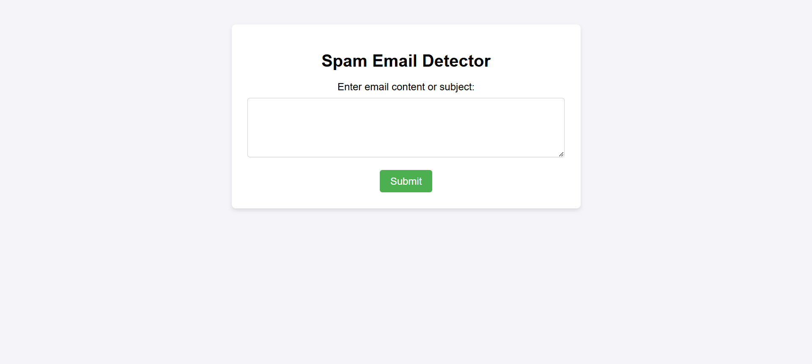
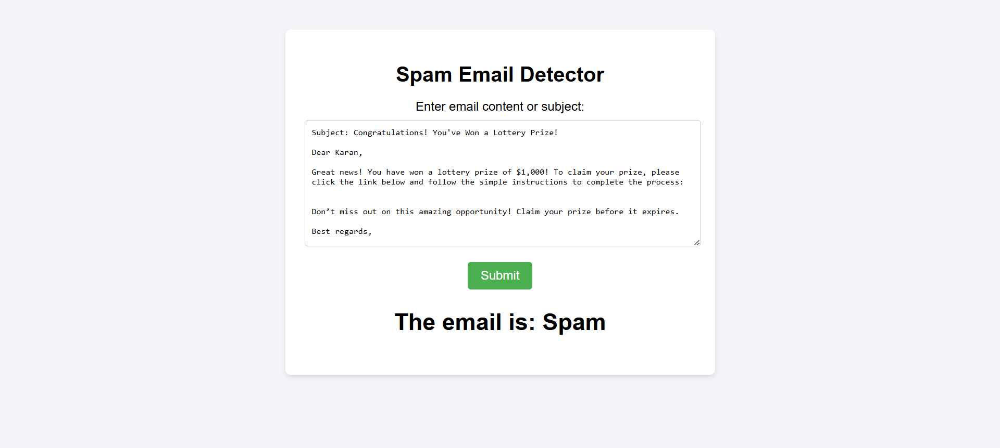

  <h1>Email Spam Detection</h1>
  
  

    A machine learning-based project to detect spam emails with a deployed web application for easy use.
  

  
 

<!-- Table of Contents -->
# Table of Contents

- [About the Project](#about-the-project)
- [Key Features](#key-features)
  * [Data Preprocessing](#data-preprocessing)
  * [Model Training](#model-training)
  * [Evaluation](#evaluation)
  * [Deployment](#deployment)
  * [Screenshots](#screenshots)
  * [Tech Stack](#tech-stack)
- [License](#license)
- [Contact](#contact)
- [Acknowledgements](#acknowledgements)
  

<!-- About the Project -->
## About the Project

This project focuses on detecting spam emails using machine learning techniques. The system is trained on a dataset containing email texts labeled as spam or not spam. Users can input an email's text to determine whether it is spam using a deployed web application.

## Key Features

### Data Preprocessing

- The dataset contains:
  - `text`: The content of the email.
  - `spam`: A binary label where `1` indicates spam and `0` indicates non-spam.
    
- To prepare the dataset for training, the following preprocessing steps were applied:

- **Data Shuffling**: Data cleaning and shuffling techniques are applied to ensure quality and randomness in training.
- **Lowercase Conversion**: All text data was converted to lowercase to ensure uniformity.
- **Tokenization**: Text was split into individual tokens (words) for further processing.
- **Removal of Special Characters**: Non-alphanumeric characters were removed to clean the data.
- **Stop Words and Punctuation Removal**: Common stop words and punctuation marks were removed to focus on meaningful content.

These preprocessing steps helped improve the quality of the dataset and enhance the performance of the model.

### Model Training

- A machine learning model is trained to classify emails as spam or not spam.
- Techniques include splitting the dataset into training and test sets to evaluate model performance.

### Evaluation

- The model's performance is evaluated using the following metrics:
  - **Accuracy**: 99.3563% (to be updated)
  - **Precision**: 98.8010%
  - **Recall**: 98.5646%
  - **F1 Score**: 98.6826%
- These metrics demonstrate the model's effectiveness in spam detection.

### Deployment

- The application is deployed using [Render](https://render.com).
- Access the deployed web application here: [Spam Email Detection Web App](https://spam-email-detection-0sef.onrender.com)

### Screenshots

Visit the web application: [Spam Email Detection Web App](https://spam-email-detection-0sef.onrender.com)

  
  
Figure 1: Home Page

  
  
  
Figure 2: Output Page

<!-- TechStack -->
### Tech Stack

  <ul>
    <li><a href="https://www.python.org/">Python</a></li>
    <li><a href="https://pandas.pydata.org/">Pandas</a></li>
    <li><a href="https://scikit-learn.org/">Scikit-learn</a></li>
    <li><a href="https://flask.palletsprojects.com/">Flask</a></li>
    <li><a href="https://render.com/">Render</a></li>
  </ul>

<!-- License -->
## License

This project is licensed under the MIT License - see the [LICENSE](LICENSE) file for details.

<!-- Contact -->
## Contact

Karan Khatri - [LinkedIn](https://www.linkedin.com/in/karan-r-khatri/)

Project Link: [Spam_Email_Detection](https://github.com/Karan6354/Spam_Email_Detection)

<!-- Acknowledgments -->
## Acknowledgements

I would like to thank the following resources that have made this project possible:

- **[Scikit-learn (sklearn)](https://scikit-learn.org/)**: This powerful machine learning library provided essential tools for implementing and evaluating our models.
- **[Pandas](https://pandas.pydata.org/)**: Pandas was crucial for data manipulation and analysis. Its data structures and functions for working with structured data allowed efficient data cleaning and preprocessing.
- **[Flask](https://flask.palletsprojects.com/)**: This lightweight web framework was used to build the application's backend.
- **[Render](https://render.com/)**: Render's deployment platform enabled smooth and reliable hosting of our web application.

I am grateful for these tools and the developers behind them for their contributions to the open-source community. Their support and continuous development have significantly enhanced the success of this project.
